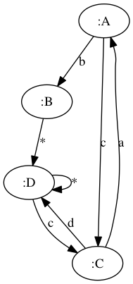

## Visualization

re-flow provides some convenience functions in the `re-flow.io` namespace that
generate GraphViz-based visualizations of a flow. To achieve this, re-flow uses
the capabilites built into [loom](https://github.com/aysylu/loom).

Since not all projects using re-flow will need to create visualizations of
flows, re-flow does not include loom directly as a dependency. Therefore, the
project must include loom directly.

You can do this by including the following dependency:

```
[aysylu/loom "1.0.0"]
```


Following is a small example that defines a flow and creates a view of it from a
Clojure REPL. The result is displayed after the example.


```clojure
(require '[re-flow.flow :refer [flow]])
(require '[re-flow.io :refer [view]])

(def my-flow (flow [{:name :A :transition {:b :B :c :C}}
                    {:name :B :transition {:re-flow.transition/default :D}}
                    {:name :C :transition {:a :A :d :D}}
                    {:name :D :transition {:c :C :re-flow.transition/default :D}}]
                   {:start :A}))

(view my-flow)
```


